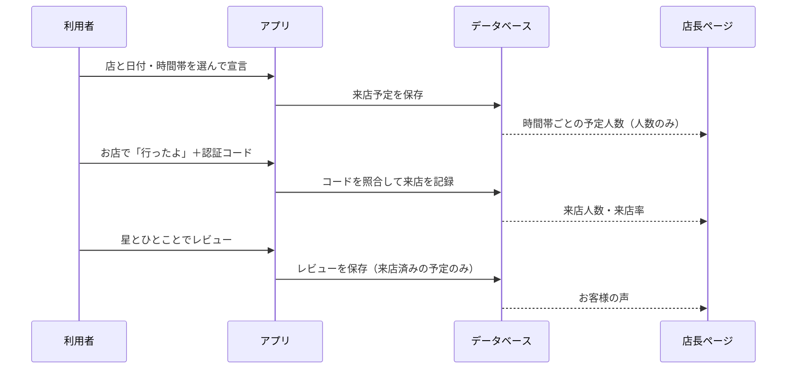
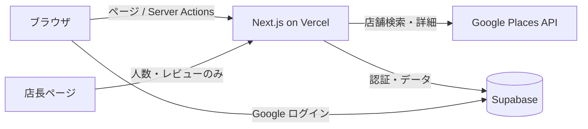

# Restaurants search APP

**「今日、行こうかな」を、お店に届ける。**

近くのお店を探して、行く日と時間帯を気軽に「宣言」し、お店では来店を証明してレビューを残せるレストラン検索アプリです。
お店側は専用の店長ページで、時間帯ごとの来店予定人数・実際の来店数・お客様の声を確認できます。

中央大学 プログラミングサークル **Venture Code** の飲食店プロジェクトとして開発している試作版です。

<!-- 【画像】トップページのスクリーンショット（PC幅）をここに -->

---

## 目次

- [背景](#背景)
- [主な機能](#主な機能)
- [画面](#画面)
- [しくみ](#しくみ)
- [技術スタック](#技術スタック)
- [ディレクトリ構成](#ディレクトリ構成)
- [セットアップ](#セットアップ)
- [データベース](#データベース)
- [セキュリティと個人情報](#セキュリティと個人情報)
- [デモの進め方](#デモの進め方)
- [既知の課題と今後](#既知の課題と今後)
- [開発の進め方](#開発の進め方)

---

## 背景

外食する人の予定は、大きく3つに分けられそうだと考えています。

| タイプ | 例 | 今使われているもの |
| --- | --- | --- |
| その場で探す | お腹が空いたから近くの店を探す | 地図アプリ |
| **なんとなく決めている** | 週末に遊びに行く日のお昼を、なんとなく考えている | **受け皿がない** |
| 予約する | サークルの飲み会を早めに予約する | グルメサイトの予約 |

真ん中の「予約するほどではないけれど、行くつもりの予定」は、今はどこにも記録されず、お店にも届いていません。
このアプリは、その予定を **来店宣言** として気軽に登録できるようにし、お店には **来る予定の人数** として届けることを目指しています。

お店へのヒアリングでは、「仕込みの量はだいたい一定で、日によって来客数が読めない」「来客数の目安がわかればロスを減らせて助かる」という声をいただいています。

---

## 主な機能

### 利用者向け

| 機能 | 内容 |
| --- | --- |
| お店を探す | 現在の住所（登録した住所）を中心に、近くのお店・ジャンル別・キーワードで検索 |
| お気に入り | 気になるお店を保存して、サイドバーから一覧できる |
| くじびき | 候補のお店を集めて、ランダムに1つ選ぶ |
| 来店宣言 | 行く日と時間帯（10〜23時台、1時間ごと）を登録。あとから変更・取り消しも可能 |
| Google カレンダーに追加 | 宣言した予定を、ワンクリックで自分のカレンダーに追加 |
| 混雑の目安 | 店ごと・時間帯ごとの「行く予定の人数」を表示（例：`19時台 4人予定`） |
| 来店認証 | お店で「行ったよ」→ 店頭の認証コードを入力して、実際に来店したことを記録 |
| レビュー | 来店認証した人だけが、星（1〜5）とひとこと（200字まで）でレビューできる |
| ポイント | 来店で 5pt、レビューで 5pt（現在は表示のみ。還元方法は構想段階） |

### お店向け（店長ページ）

ログイン不要の店ごとの専用URL（推測できない長いトークン）で開きます。5秒ごとに自動更新されます。

- 今日の予定人数・来店人数・来店率
- 来店認証コード（お客様に伝える用）
- 今後7日間の日別予定人数
- お客様の声（平均の星・件数・最近のレビュー）
- 右列：**データ活用による来店予測の構想イメージ**（サンプルデータ。実データとはつながっていません）

> 店長ページに出るのは **人数とレビュー内容だけ** で、誰が予定・来店したかは表示されません。

---

## 画面

<!-- 【画像】以下、スクリーンショットを差し込む -->

| 画面 | 説明 |
| --- | --- |
| `docs/images/top.png` | トップページ（近くのお店のカルーセル、混雑ラベル） |
| `docs/images/detail.png` | 店の詳細（営業時間、時間帯ごとの予定人数、各ボタン） |
| `docs/images/visit-plan.png` | 来店宣言（日付と時間帯の選択） |
| `docs/images/sidebar.png` | サイドバー（お気に入り、これから行く、レビューを書く、ポイント） |
| `docs/images/verify.png` | 来店認証 → レビュー |
| `docs/images/store-page.png` | 店長ページ |

---

## しくみ

### 来店宣言から店長ページまでの流れ



### 来店認証のルール

| ルール | 内容 | 目的 |
| --- | --- | --- |
| 1時間前ルール | 行く時間帯の始まりの **1時間以上前** に宣言した予定だけ認証できる | 店の前での駆け込み宣言を防ぐ |
| 認証できる時間 | 時間帯の始まりの **15分前から3時間後まで** | 食券機の店（注文時）にも、食後の認証にも対応 |
| 1予定1回 | 同じ予定で2回は認証できない | 二重カウントを防ぐ |
| 判定は最初の宣言時刻 | 予定を変更しても、1時間前ルールは最初に宣言した時刻で判定 | 早めに宣言して少し遅れた人が損をしない |
| 認証済みは変更・削除不可 | 来店記録は残る | 店側の実績が変わらない |

認証コードの照合はデータベースの関数（`verify_visit`）の中で行い、コード自体はブラウザに送られません。

---

## 技術スタック

| 分類 | 使用技術 |
| --- | --- |
| フレームワーク | Next.js 16（App Router）、React 19、TypeScript（strict） |
| スタイリング | Tailwind CSS v4、shadcn/ui（Radix UI）、lucide-react、embla-carousel |
| データ取得 | SWR、Server Actions |
| 認証・データベース | Supabase（Google ログイン、PostgreSQL、Row Level Security） |
| 店舗情報 | Google Places API (New) |
| ホスティング | Vercel（Firewall による回数制限） |
| パッケージ管理 | pnpm |



---

## ディレクトリ構成

主要なものだけを抜粋しています。

```text
src/
├─ app/
│  ├─ (auth)/                    # ログイン、OAuth コールバック
│  ├─ (private)/                 # ログインが必要な画面
│  │  ├─ page.tsx                # トップページ
│  │  ├─ search/                 # 検索結果
│  │  ├─ restaurant/[restaurant] # ジャンル別一覧
│  │  └─ actions/                # Server Actions（住所、店舗詳細、来店予定）
│  ├─ store/[token]/             # 店長ページ（ログイン不要・トークンで表示）
│  └─ api/
│     ├─ address/                # 住所の保存・候補
│     ├─ restaurant/autocomplete # 店名の候補
│     └─ store/[token]/          # 店長ページ用の集計・レビュー
├─ components/
│  ├─ ui/                        # カード、詳細モーダル、サイドバー、来店宣言・認証・レビュー、混雑表示
│  └─ store/                     # 店長ページの部品
├─ lib/
│  ├─ restaurants/               # Google Places の呼び出し
│  ├─ calendar/                  # 日付・時間帯の計算、Google カレンダーURL、SWR
│  ├─ store/                     # 店長ページの集計・レビュー・構想イメージのサンプルデータ
│  └─ points/                    # ポイントの計算
├─ utils/supabase/               # Supabase クライアント
└─ middleware.ts                 # 未ログイン時のリダイレクト
docs/
├─ sql/                          # データベースの定義とテスト SQL
└─ demo/                         # デモの台本、試用者向けガイド
```

---

## セットアップ

### 必要なもの

- Node.js 20 以上
- pnpm
- Supabase のプロジェクト
- Google Cloud のプロジェクト（Places API (New) を有効化した API キー、Google ログイン用の OAuth クライアント）

### 1. インストール

```bash
git clone <このリポジトリのURL>
cd <リポジトリ名>
pnpm install
```

### 2. 環境変数

`.env.local` を作成します。

```bash
NEXT_PUBLIC_SUPABASE_URL=            # Supabase のプロジェクトURL
NEXT_PUBLIC_SUPABASE_PUBLISHABLE_KEY= # Supabase の公開用キー
NEXT_PUBLIC_SITE_URL=                # 例: http://localhost:3000
GOOGLE_API_KEY=                      # Places API (New) 用（サーバー側でのみ使用）
ENABLE_PLACE_PHOTOS=false            # 店舗写真を取得するか（下記の注意を参照）
ENABLE_MOCK_API=false                # true にすると Google を呼ばずにモックデータで動作
```

> `.env.local` は Git の管理対象外です。キーをコミットしないでください。

### 3. データベース

Supabase の SQL Editor で、`docs/sql/` の SQL を **番号順に** 実行します。各 `*_test.sql` は貼って1回実行するだけで結果が表で出るテストで、最後の行の「総合(NGの件数)」が 0 なら成功です（テストはすべて rollback され、データは残りません）。

詳しくは [データベース](#データベース) を参照してください。

### 4. Google ログイン

1. Google Cloud で OAuth クライアントを作成し、Supabase の Authentication → Providers → Google に設定
2. Supabase の Authentication → URL Configuration で、Site URL とリダイレクト先（ローカルと本番）を登録
3. 試用段階では OAuth 同意画面を「テスト」のままにし、使う人の Gmail をテストユーザーに追加

### 5. 起動

```bash
pnpm dev     # 開発サーバー（http://localhost:3000）
pnpm build   # 本番ビルド（型エラーがあると失敗します）
pnpm lint    # ESLint
```

> Windows で OneDrive 配下に置くと、`.next` のキャッシュが壊れて起動に失敗することがあります。その場合は `.next` を削除して起動し直すか、OneDrive の外に置いてください。

### 店舗写真について

`ENABLE_PLACE_PHOTOS=true` にすると店舗写真が表示されますが、写真の取得は1枚ごとに Places API の料金が発生します。また、現状の実装では写真URLに API キーが含まれるため、**普段は `false` のまま運用し、デモのときだけ短時間有効にする** 想定です（[既知の課題](#既知の課題と今後) を参照）。

---

## データベース

### テーブル

| テーブル | 内容 | 主なアクセス制御 |
| --- | --- | --- |
| `profiles` | ユーザーごとの設定（選択中の住所） | 本人のみ。新規ログイン時にトリガーで作成 |
| `addresses` | 登録した住所 | 本人のみ |
| `favorites` | お気に入りのお店 | 本人のみ |
| `visit_plans` | 来店予定（店・日付・時間帯・来店日時） | 本人は閲覧・宣言・取り消しのみ。変更と来店記録は関数経由 |
| `visit_reviews` | レビュー（星・ひとこと） | 本人は閲覧のみ。書き込みは関数経由 |
| `stores` | 参加店舗（認証コード、店長ページのトークン） | 利用者からは直接読めない |

アカウントを削除すると、そのユーザーのプロフィール・住所・お気に入り・予定・レビューも一緒に削除されます（`ON DELETE CASCADE`）。

### 関数（SECURITY DEFINER）

| 関数 | 役割 |
| --- | --- |
| `verify_visit` | 認証コードと時間のルールを確認し、来店を記録 |
| `update_visit_plan` | 予定の日付・時間帯を変更（最初の宣言時刻は保持） |
| `submit_review` | 来店済みの自分の予定にだけレビューを保存 |
| `visit_plan_counts` | 店・日付ごとの時間帯別の予定人数を返す（人数のみ） |
| `store_stats` | 店長ページ用の日別の予定・来店人数 |
| `store_reviews` | 店長ページ用の平均の星・件数・最近のレビュー（書いた人の情報は返さない） |

すべて `search_path` を空に固定し、必要なロールにだけ実行権限を与えています。

### SQL ファイル

| ファイル | 内容 |
| --- | --- |
| `001_visit_plans.sql` | 来店予定テーブル |
| `002_stores.sql` | 店舗テーブル、来店予定の権限の締め直し |
| `003_verify_visit.sql` | 来店認証の関数（※ 008 で置き換え済み。再実行しないこと） |
| `004_store_stats.sql` | 店長ページの集計関数 |
| `005_demo_*.sql` | デモ用の状態確認・リセット |
| `006_visit_reviews.sql` | レビューテーブルと保存関数 |
| `007_store_reviews.sql` | 店長ページのレビュー関数 |
| `008_visit_hours.sql` | 時間帯の追加と、来店認証ルールの変更 |
| `009_update_visit_plan.sql` | 予定の変更関数 |
| `010_visit_plan_counts.sql` | 混雑表示用の集計関数 |
| `011_require_visit_hour.sql` | 新しい宣言で時間帯を必須にする |
| `012_security_check.sql` | 権限・ポリシーの点検（読み取り専用） |
| `013_tighten_user_tables.sql` | `profiles` / `addresses` / `favorites` の権限の締め直し、退会時の削除連動 |

> `profiles` / `addresses` / `favorites` の初期定義は、リポジトリ外で作成したため `docs/sql/` には含まれていません。

### 混雑表示をログインなしで公開するとき

現在は `visit_plan_counts` をログインした人だけが呼べます。公開する場合は、次の1行を実行します。

```sql
grant execute on function public.visit_plan_counts(text[], date) to anon;
```

---

## セキュリティと個人情報

個人情報は「**持たない・見せない・絞る**」を基本にしています。

**持たない**
- ログインは Google アカウントのみで、パスワードは保持しません
- 電話番号、生年月日、クレジットカード情報などは取得しません
- 保持しているのは、メールアドレス・表示名・アイコンURL、来店予定・来店記録・レビュー、検索用の住所が中心です

**見せない**
- すべてのテーブルで Row Level Security を有効にし、本人のデータは本人しか読み書きできません
- ログインしていない利用者の権限は外しています
- 店長ページに返すのは人数とレビュー内容だけで、ユーザーIDや予定IDは返しません
- エラーの詳細（DB や Google のエラー文）は画面に出さず、サーバーのログにのみ残します

**絞る（料金と外部サービス）**
- Google を呼ぶ前に必ずログインを確認します
- Google Cloud で API キーを Places API (New) に限定し、API ごとに1日の上限回数を設定しています
- Vercel Firewall で、検索候補 API などに IP ごとの回数制限を設けています
- 画面に Google Maps の出典を表示しています

**確認の方法**
- 権限・ポリシーの変更には、必ず `*_test.sql` を用意し、他人のデータが見えない・書けないことを実行して確かめています

---

## デモの進め方

`docs/demo/demo-guide.md` に、PC（店長ページ）とスマホ（利用者）を使った台本、事前準備、トラブル時の対応をまとめています。

来店認証は「1時間前までに宣言した予定」だけが対象のため、デモでは事前に予定を登録し、`005_demo_reset.sql` のブロック H で「認証できる状態」にしてから始めます。

試用者向けの使い方は `docs/demo/friend-guide.md` にあります。

---

## 既知の課題と今後

### 一般公開までに対応すること

- [ ] プライバシーポリシー、利用規約、問い合わせ先の整備
- [ ] アカウント削除（退会）機能（DB 側の削除連動は対応済み）
- [ ] 認証コードの総当たり対策（失敗回数の制限）と、店ごとの推測されにくいコード
- [ ] 店長ページのトークンのハッシュ化
- [ ] Google から取得したデータの保存期間への対応（住所検索の別サービスへの切り替えを検討）
- [ ] 店舗写真：API キーをブラウザに渡さない取得方法への変更と、撮影者の帰属表示
- [ ] ESLint の残りの指摘（`any` の使用、effect 内での state 更新など）
- [ ] Next.js の名称変更への追従（`middleware` → `proxy`、`useCache` → `cacheComponents`）
- [ ] OAuth 同意画面の公開設定、Supabase のプランとバックアップ

### 構想中の機能

- **来店宣言＋お店の特典**：来店認証と同時に、お店が決めた特典（トッピング無料など）を受け取れる仕組み。お店の負担は「初めて来たお客様1人につき定額」の成果報酬型を検討
- **かざすだけの来店認証**：店頭の NFC タグにスマホをかざして来店を記録
- **食べたものの記録**：来店後にメニューから選ぶ形で開始し、将来は食券機やレジのデータとの連携を検討
- **来店予測**：過去の来店率と予定人数から予測来店数を算出。さらに外部データと組み合わせた予測（店長ページ右列の構想イメージ）
- **好みの傾向の分析**：本人の同意を前提に、個人を特定しない集計単位で、お店ごとの客層の傾向を提供

---

## 開発の進め方

- `main` から `feature/*` ブランチを切って作業し、`--no-ff` でマージします
- データベースの変更は `docs/sql/` に番号付きで追加し、テスト SQL とセットにします
- 1ステップごとに動作確認 → コミット、の小さな単位で進めます
- `pnpm build` は型チェックを含むため、型エラーがあると失敗します
